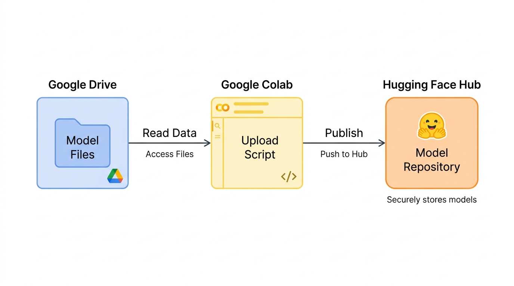

# Google Drive to Hugging Face Uploader

A lightweight Google Colab workflow to upload model files or entire model folders from Google Drive to Hugging Face Hub.

## Overview

Large model checkpoints often exceed Google Drive storage limits or are difficult to manage locally. This repository provides a simple and reproducible pipeline to transfer such models directly from Google Drive to Hugging Face Hub.

The implementation is intentionally minimal and designed for ease of use in research workflows.

---
## Features

- Upload a full model directory to Hugging Face
- Upload individual model files
- Automatic Hugging Face repository creation
- Support for private model repositories
- Designed for Google Colab environments
---
## Repository Structure
```
├── drive_to_huggingface_uploader.ipynb # Main Colab workflow
├── drive_to_huggingface_uploader.py # Script version
├── .gitignore
└── LICENSE
```
---
## Requirements

Install dependencies:
This workflow is designed for Google Colab.

Required package is installed inside the notebook:
```
pip install huggingface_hub
```

---
## Usage (Colab Recommended)
- Open the notebook in Google Colab
- Mount Google Drive
- Login to Hugging Face
- Update configuration variables
- Run all cells

### Example Configuration
```

username = "your_huggingface_username"
repo_name = "your_model_repository"

model_folder = "/content/drive/MyDrive/Models/your_model_folder"
model_file = "/content/drive/MyDrive/Models/your_model_file.pt"
```
---
## Workflow
- Mount Google Drive
- Authenticate with Hugging Face
- Create a model repository
- Upload folder or file to Hugging Face
---

## Notes
- Model files are uploaded to Hugging Face, not GitHub
- Large uploads may take time
- Upload is file by file
- Repository is private by default
---

## Limitations
- No resumable uploads
- Sequential upload only
- No retry mechanism
- Not designed for automated pipelines
---

## Security Considerations
Do not commit Hugging Face tokens
Do not expose private paths
Use login() or environment variables
